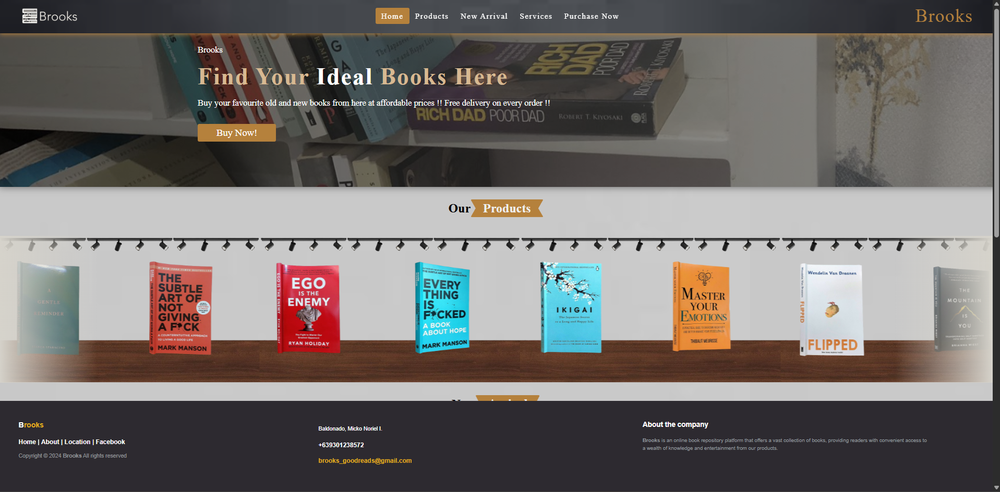
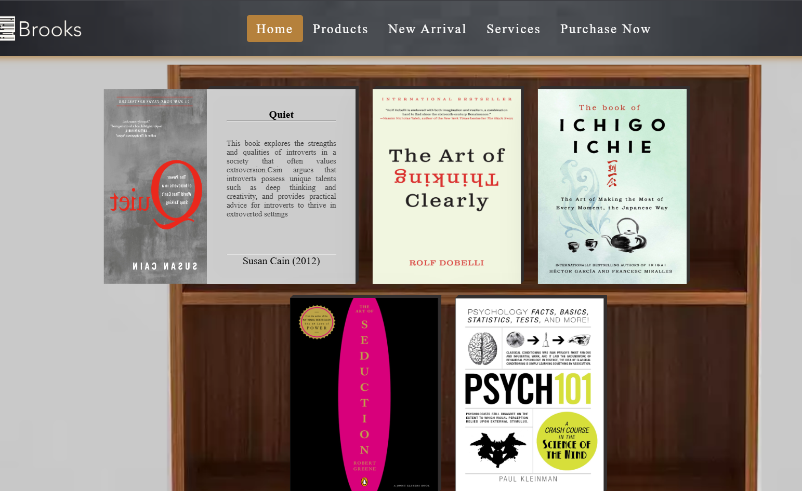
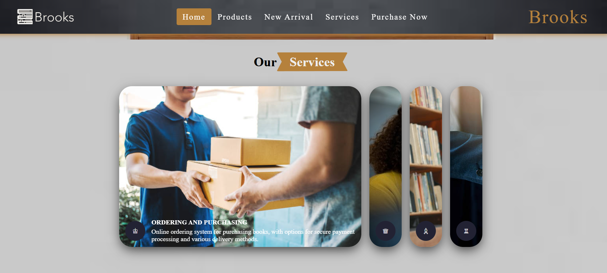
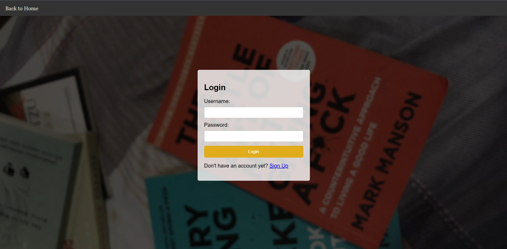

# 📚 Brooks – Online Book Repository Platform

Brooks is a responsive front-end online bookstore website developed using HTML, CSS, and JavaScript.  
It simulates an e-commerce platform where users can browse books, view new arrivals, and access purchasing features.

---

## 🚀 Features

### 🏠 Home Section
- Clean and modern landing page
- Responsive design for desktop and mobile devices

### 📦 Products Section
- Auto-sliding product showcase (right to left animation)
- Smooth visual presentation of available books

### 🆕 New Arrivals
- Interactive hover effect
- Books visually "open" when hovered
- Displays:
  - Book summary
  - Author information

### 🛠 Services Section
Includes:
1. Book ordering & purchasing
2. Customer support
3. Book catalog browsing
4. Subscription services

### 🔐 Purchase Now (Login Page)
- Separate login and sign-up interface (front-end only)
- No database integration
- Custom recorded book montage video background
- Back button navigation to home page

---

## 🛠 Technologies Used

- HTML5
- CSS3
- JavaScript (Vanilla JS)

---

## 📱 Responsiveness

The website is fully responsive and optimized for:
- Desktop
- Tablet
- Mobile devices

---

## 🎯 Project Purpose

This project was developed as part of my Web Development coursework during my Computer Engineering degree.  
It demonstrates front-end design, UI interaction, animation effects, and responsive layout implementation.

---

## 📸 Screenshots

---

## 👨‍💻 Author

**Micko Noriel I. Baldonado**  
4th Year Computer Engineering Student  
https://www.linkedin.com/in/baldonadomicko/
